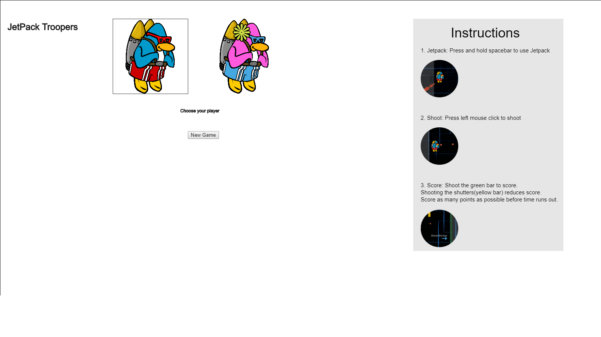
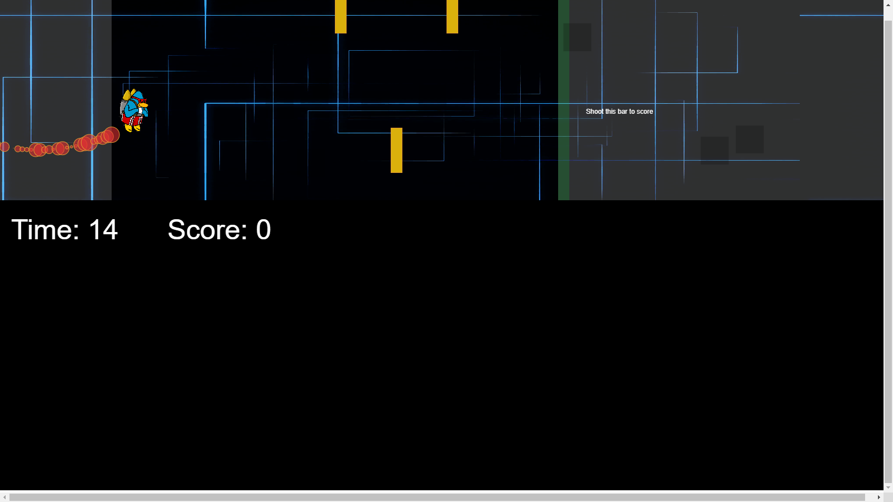

# JetPack Troopers

## About Project:
 **Project by:** Manouj Kumar

 **Term:** Fall 18 (Mid-Term)

 **Programming Language:** p5.js

This game will serve as the deliverable for the **CIM-640** Mid term project.

In order to test my understanding and to put my learnings into effect, I created an interactive game called JetPack Troopers. My interest in game design and development served as the major motivation for this project.

I started with a simple idea of adding gravity (a constant force) to an object and then went on to add bullets and hit zones. I then tweaked the configurations like speed, size etc to make the game playable.

#### Game inputs:
1. Use Jetpack - SpaceBar
2. Shoot - Left Mouse Button / b [keyboard]
3. Add misc objects - o [Keyboard]
4. Timer

#### Game Outputs:
1. Score - Number of bullets that reach the green bar.

#### Target Audience:
JetPack Troopers is intended for video game lovers. It has no age restriction.

#### Where will the project be displayed:
Jetpack Troopers is a web based game which can be played on any desktop computers.

#### screenshots:

#### References:

